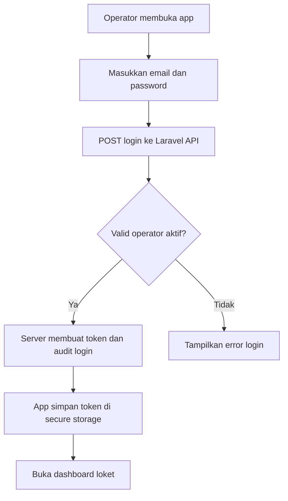
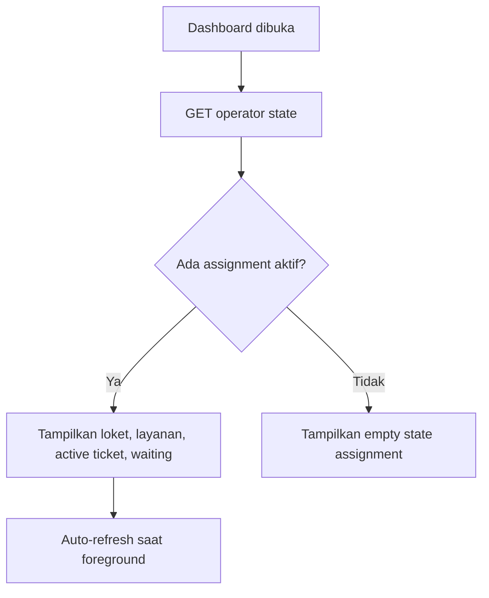
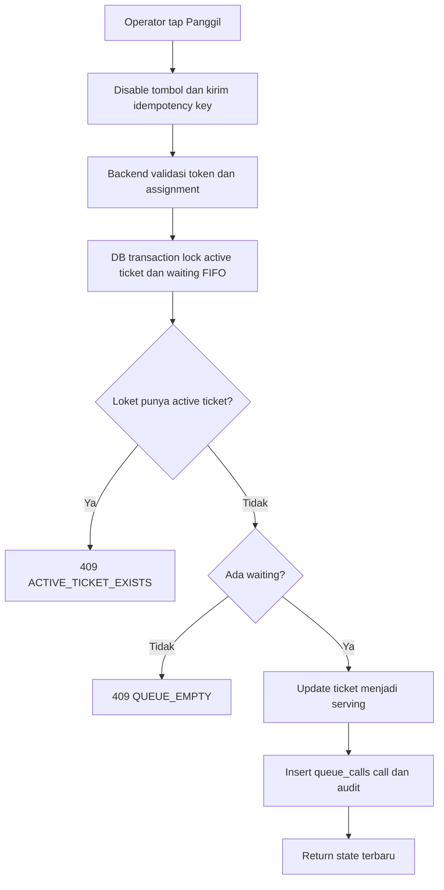
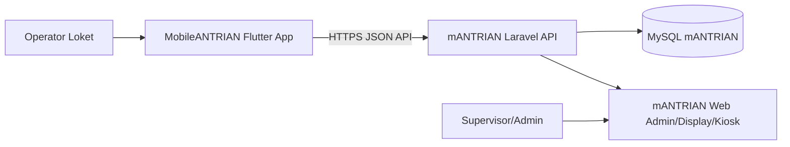

# Blueprint Aplikasi MobileANTRIAN

## 1. Document Control

| Item | Nilai |
|---|---|
| Judul | Blueprint Aplikasi MobileANTRIAN untuk Operator Loket |
| Versi | 1.0 |
| Tanggal | 2026-05-06 |
| Prepared for | Tim implementasi Flutter, Laravel API, QA, DevOps |
| Prepared by | Codex - Analis Aplikasi |
| Status | Draft implementasi siap coding |
| Stack target | Flutter/Dart mobile client, Laravel API adapter, MySQL mANTRIAN web |

### Change History

| Versi | Tanggal | Perubahan | Penyusun |
|---|---|---|---|
| 1.0 | 2026-05-06 | Dokumen awal blueprint MobileANTRIAN | Codex |

## 2. Executive Summary

MobileANTRIAN adalah aplikasi mobile internal untuk operator loket layanan yang menjalankan fungsi pemanggilan antrian dari perangkat Android/iOS berbasis Flutter. Aplikasi ini memperluas mANTRIAN versi web, menggunakan database MySQL yang sama, dan mempertahankan aturan bisnis versi web: operator hanya dapat melayani loket yang ditugaskan, hanya satu tiket aktif per loket, pemanggilan mengambil tiket `waiting` paling lama sesuai layanan loket, serta semua aksi penting dicatat di `queue_calls` dan `audit_logs`.

Masalah utama yang diselesaikan adalah ketergantungan operator pada browser desktop. Dengan aplikasi mobile, operator dapat bekerja dari tablet/ponsel loket, tetap melihat nomor aktif dan daftar tunggu, serta melakukan aksi utama `panggil`, `ulang`, `skip`, dan `selesai` dengan UI yang lebih ringkas.

### Expected Outcomes

| Outcome | Target |
|---|---|
| Mobilitas operator | Operator dapat menjalankan loket dari perangkat mobile internal |
| Konsistensi dengan web | Semua aksi mobile menghasilkan data yang sama dengan aksi operator web |
| Kecepatan aksi loket | P95 respons API aksi operator <= 1 detik pada jaringan LAN stabil |
| Audit operasional | 100% login, call, recall, skip, done, dan logout tercatat |
| Risiko data rendah | Tidak ada credential database tersimpan di aplikasi mobile |

### Success Metrics

| ID | Metric | Target MVP |
|---|---|---|
| SM-001 | Login operator berhasil | >= 99% pada akun aktif dan jaringan tersedia |
| SM-002 | Latensi call next | P95 <= 1 detik response backend |
| SM-003 | Duplikasi tiket aktif per loket | 0 kasus karena validasi transaksi backend |
| SM-004 | Error otorisasi assignment | 100% operator tanpa assignment ditolak |
| SM-005 | Konsistensi display web | Perubahan dari mobile tampil di display web <= 5 detik polling |

## 3. Goals, Scope, and Constraints

### Business Goals

| ID | Goal | Ukuran Keberhasilan |
|---|---|---|
| BG-001 | Mempercepat operasional loket | Operator menjalankan aksi utama dari satu layar mobile |
| BG-002 | Memperluas kanal operator tanpa mengganti sistem web | Database, laporan, display, dan audit tetap di mANTRIAN web |
| BG-003 | Mengurangi kebutuhan perangkat desktop di loket | Tablet/ponsel internal dapat menjadi console loket |
| BG-004 | Menjaga tata kelola antrian | Assignment, status, FIFO, dan audit tidak bisa dilewati oleh client |

### Product Goals

| ID | Goal | Ukuran Keberhasilan |
|---|---|---|
| PG-001 | Operator cepat memahami status loket | Nomor aktif, loket, layanan, dan daftar tunggu tampil di dashboard |
| PG-002 | Aksi kritis minim salah tekan | Tombol destructive seperti `Skip` memakai konfirmasi/opsi alasan |
| PG-003 | Mobile tetap sinkron dengan web | Pull-to-refresh dan polling state tersedia |
| PG-004 | Implementasi backend reuse logic web | API memanggil action/service Laravel yang sudah ada atau ekuivalen |

### In Scope MVP

| ID | Scope |
|---|---|
| SC-001 | Login operator mobile |
| SC-002 | Penyimpanan token aman di device |
| SC-003 | Lihat assignment loket aktif operator |
| SC-004 | Lihat nomor aktif loket |
| SC-005 | Lihat daftar antrian `waiting` sesuai layanan loket |
| SC-006 | Panggil nomor berikutnya |
| SC-007 | Ulang panggil nomor aktif |
| SC-008 | Skip nomor aktif dengan alasan opsional |
| SC-009 | Selesaikan layanan nomor aktif dengan catatan opsional |
| SC-010 | Refresh otomatis dan manual |
| SC-011 | Riwayat aksi operator hari ini |
| SC-012 | Logout dan revoke token |

### Out of Scope MVP

| ID | Out of Scope | Catatan |
|---|---|---|
| OS-001 | Pengambilan tiket oleh pengunjung dari mobile | Tetap lewat kiosk/web |
| OS-002 | Admin CRUD layanan/loket dari mobile | Tetap lewat web admin |
| OS-003 | Display TV mobile | Tetap lewat display web |
| OS-004 | Direct database connection dari mobile | Tidak direkomendasikan karena risiko keamanan dan transaksi |
| OS-005 | Mode offline untuk aksi panggil | Tidak aman karena bisa membuat state bentrok |
| OS-006 | Push notification publik | Fase lanjutan bila ada kebutuhan |

### Constraints

| ID | Constraint | Dampak |
|---|---|
| CN-001 | Database MySQL mANTRIAN web menjadi sumber kebenaran | API mobile harus mengikuti schema dan action Laravel |
| CN-002 | Operator hanya boleh satu assignment aktif utama pada MVP | UI dashboard mengasumsikan satu loket aktif; multi-loket menjadi fase 2 |
| CN-003 | Jaringan internal dapat fluktuatif | Client perlu timeout, retry terbatas, dan status koneksi jelas |
| CN-004 | Aksi antrian bersifat transaksional | Semua write action dilakukan di backend Laravel dengan DB transaction |

## 4. Stakeholders and Users

| Role | Goals | Responsibilities | Pain Points | Success Criteria |
|---|---|---|---|---|
| Operator Loket | Memanggil dan menyelesaikan antrian dari perangkat mobile | Login, memantau waiting, call, recall, skip, done | Browser desktop tidak praktis, salah klik, koneksi putus | Aksi utama cepat, status jelas, error bisa dipahami |
| Admin mANTRIAN | Menugaskan operator dan loket | Kelola user, loket, layanan, assignment di web | Perlu memastikan mobile tidak mengubah konfigurasi | Assignment web langsung berlaku di mobile |
| Supervisor | Memantau layanan | Review laporan dan audit di web | Perlu tahu aksi mobile tercatat | Audit membedakan sumber `mobile` |
| Technical Operator | Menjaga API dan app berjalan | Deploy API, distribusi APK/IPA, monitoring | Error device sulit dilacak | Log API dan crash report tersedia |
| Auditor Internal | Menelusuri aksi layanan | Review audit log | Aksi mobile bisa tidak terlacak bila direct DB | Semua aksi melewati audit backend |

## 5. Operating Context

| Area | Spesifikasi |
|---|---|
| Application type | Mobile internal operator console |
| Platform MVP | Android 10+; iOS 14+ opsional |
| Backend | Laravel API pada aplikasi mANTRIAN web |
| Database | MySQL/MariaDB mANTRIAN web |
| Network | LAN kantor, VPN, atau HTTPS internal/public |
| Data sensitivity | Sedang; berisi akun operator, loket, histori layanan, metadata device |
| Operational hours | Mengikuti `operating_hours` aplikasi web |
| Peak usage | Awal jam layanan, setelah istirahat, hari pelayanan tinggi |
| Compliance baseline | OWASP MASVS mobile baseline, OWASP API Top 10, auditability, privacy by design |

## 6. Role and Permission Model

| Role | Permission Mobile |
|---|---|
| Operator | Login mobile, lihat assignment sendiri, lihat waiting sesuai layanan loket, call/recall/skip/done tiket aktif loketnya |
| Admin | Tidak memakai mobile MVP; dapat melihat audit aktivitas mobile dari web |
| Supervisor | Tidak memakai mobile MVP; dapat melihat laporan dari web |
| Device Support | Tidak memiliki akun aplikasi; hanya membantu instalasi dan troubleshooting |

### Permission Matrix

| Capability | Operator Assigned | Operator Unassigned | Admin | Supervisor |
|---|---:|---:|---:|---:|
| Login mobile | Yes | Yes | No MVP | No MVP |
| View active counter | Yes | Empty state | No MVP | No MVP |
| View waiting queue | Yes, assigned services only | No | No MVP | No MVP |
| Call next | Yes | No | No MVP | No MVP |
| Recall active | Yes | No | No MVP | No MVP |
| Skip active | Yes | No | No MVP | No MVP |
| Complete active | Yes | No | No MVP | No MVP |
| Manage services/counters | No | No | Web only | No |
| View reports | No MVP | No | Web only | Web only |

## 7. Functional Requirements

| ID | Module | Requirement | Priority | Role | Acceptance Criteria |
|---|---|---|---|---|---|
| FR-001 | Auth | Aplikasi menyediakan login email/password untuk operator aktif | Must | Operator | Akun `role=operator` dan `is_active=true` mendapat token; akun lain ditolak |
| FR-002 | Auth | Aplikasi menyimpan token secara aman | Must | Operator | Token tersimpan di secure storage; logout menghapus token lokal dan revoke server |
| FR-003 | Session | Aplikasi memulihkan session saat dibuka ulang | Must | Operator | Token valid membuka dashboard; token invalid diarahkan ke login |
| FR-004 | Assignment | Aplikasi mengambil assignment aktif operator | Must | Operator | Menampilkan counter name/location dan layanan yang dapat dilayani |
| FR-005 | Assignment | Operator tanpa assignment mendapat empty state | Must | Operator | Tidak ada tombol call; pesan meminta hubungi admin |
| FR-006 | Queue State | Aplikasi menampilkan tiket aktif loket | Must | Operator | Nomor tiket, layanan, status, waktu panggil, durasi tampil |
| FR-007 | Queue State | Aplikasi menampilkan daftar waiting sesuai layanan loket | Must | Operator | Maksimal 20 item awal; urut FIFO berdasarkan `created_at`, `id` |
| FR-008 | Queue State | Aplikasi menyediakan refresh manual | Must | Operator | Pull-to-refresh memperbarui active dan waiting |
| FR-009 | Queue State | Aplikasi melakukan auto-refresh | Should | Operator | Interval default 5 detik saat app foreground |
| FR-010 | Call | Operator dapat memanggil nomor berikutnya | Must | Operator | Backend mengubah tiket `waiting` menjadi `serving`, membuat `queue_calls.event_type=call`, audit tercatat |
| FR-011 | Call | Jika tidak ada antrian, sistem memberi feedback jelas | Must | Operator | API mengembalikan error terstruktur; UI menampilkan state kosong tanpa crash |
| FR-012 | Call | Jika loket masih punya tiket aktif, call next ditolak | Must | Operator | UI menampilkan instruksi selesaikan/skip tiket aktif |
| FR-013 | Recall | Operator dapat mengulang panggilan tiket aktif | Must | Operator | Membuat `queue_calls.event_type=recall`, tidak mengubah status tiket |
| FR-014 | Skip | Operator dapat melewati tiket aktif | Must | Operator | Status tiket menjadi `skipped`, `skipped_at` terisi, event `skip` dan audit tercatat |
| FR-015 | Skip | Operator dapat mengisi alasan skip opsional | Should | Operator | Alasan maksimal 255 karakter dikirim ke `queue_calls.notes` |
| FR-016 | Complete | Operator dapat menyelesaikan tiket aktif | Must | Operator | Status menjadi `done`, `completed_at` terisi, event `done` dan audit tercatat |
| FR-017 | History | Operator dapat melihat riwayat aksi hari ini | Should | Operator | Daftar event call/recall/skip/done miliknya hari ini tampil |
| FR-018 | Connectivity | Aplikasi menampilkan status koneksi | Must | Operator | Timeout/error jaringan menampilkan banner dan tombol coba lagi |
| FR-019 | Audit | Semua aksi mobile mengirim metadata source | Must | Sistem | `audit_logs.metadata.source=mobile`, app version, platform, device id pseudonymous |
| FR-020 | Versioning | Aplikasi memvalidasi kompatibilitas API | Should | Sistem | Endpoint `/api/mobile/v1/meta` mengembalikan min supported app version |

## 8. Business Rules

| ID | Rule | Applies To | Source | Exception Handling |
|---|---|---|---|---|
| BR-001 | Mobile hanya boleh dipakai oleh user `role=operator` aktif | Auth | Security | Return `403 ROLE_NOT_ALLOWED` |
| BR-002 | Operator hanya boleh mengakses assignment miliknya | Assignment | Existing web rule | Return `403 ASSIGNMENT_REQUIRED` |
| BR-003 | Assignment aktif ditentukan dari `counter_assignments.is_active=true` untuk user login | Assignment | Existing schema | Bila lebih dari satu, MVP memakai assignment terbaru dan mencatat warning |
| BR-004 | Layanan loket berasal dari relasi `counter_services` pada counter assignment | Queue | Existing schema | Jika tidak ada layanan, call next ditolak |
| BR-005 | Panggil berikutnya mengambil tiket `waiting` tanggal berjalan, layanan aktif, FIFO `created_at`, `id` | Queue | Existing action | Jika kosong, return `409 QUEUE_EMPTY` |
| BR-006 | Satu loket hanya boleh punya satu tiket aktif dengan status dalam `Ticket::ACTIVE_STATUSES` | Queue | Existing action | Return `409 ACTIVE_TICKET_EXISTS` |
| BR-007 | Tiket aktif untuk aksi recall/skip/done harus pernah dipanggil oleh loket tersebut | Queue | Existing guard | Return `422 TICKET_NOT_ACTIVE_FOR_COUNTER` |
| BR-008 | Aksi write mobile tidak boleh dimasukkan ke local queue offline | Integrity | Recommendation | User harus retry saat online |
| BR-009 | Semua waktu mengikuti timezone aplikasi Laravel, saat ini `config('app.timezone')` | Reporting | Existing behavior | Client hanya menampilkan timezone dari server |
| BR-010 | Mobile tidak mengubah master data layanan/loket/user | Governance | Scope | Semua konfigurasi tetap melalui web admin |

## 9. Non-Functional Requirements

| ID | Quality Attribute | Requirement | Target/Metric | Verification |
|---|---|---|---|---|
| NFR-001 | Performance | Dashboard mobile memuat state awal cepat | P95 <= 2 detik pada LAN |
| NFR-002 | Performance | Aksi call/recall/skip/done cepat | P95 <= 1 detik backend response |
| NFR-003 | Availability | API mobile tersedia selama jam layanan | >= 99% monthly saat jam operasional |
| NFR-004 | Integrity | Tidak ada konflik status akibat mobile dan web bersamaan | 0 duplicate active ticket per counter |
| NFR-005 | Security | Mobile tidak menyimpan credential MySQL | 100% device tidak memiliki DB host/user/password |
| NFR-006 | Security | Semua API write memakai bearer token dan authorization backend | 100% endpoint protected |
| NFR-007 | Privacy | Metadata device tidak menyimpan IMEI/nomor telepon mentah | Gunakan generated installation UUID/pseudonymous ID |
| NFR-008 | Accessibility | UI operator memenuhi aksesibilitas dasar | Kontras WCAG AA, target tap minimum 48dp |
| NFR-009 | Reliability | App tahan jaringan putus | Tidak crash; state terakhir read-only; retry tersedia |
| NFR-010 | Maintainability | Flutter memakai layering jelas | presentation, domain, data, core terpisah |
| NFR-011 | Observability | Error mobile dapat ditelusuri | Correlation ID per request, server log, optional crash reporting |
| NFR-012 | Compatibility | API versioned | Semua endpoint mobile di `/api/mobile/v1` |

## 10. Domain Model and Data Design

| Entity | Purpose Mobile | Key Fields | Relationships | Lifecycle States |
|---|---|---|---|---|
| `users` | Identitas operator | `id`, `name`, `email`, `role`, `is_active`, `last_login_at` | hasMany `counter_assignments`, `queue_calls` | active, inactive |
| `counters` | Loket operator | `id`, `code`, `name`, `location`, `is_active` | belongsToMany `services`, hasMany `queue_calls` | active, inactive |
| `services` | Layanan yang dilayani loket | `id`, `code`, `name`, `prefix`, `is_active`, `sort_order` | belongsToMany `counters`, hasMany `tickets` | active, inactive |
| `counter_assignments` | Hak operator atas loket | `user_id`, `counter_id`, `start_at`, `end_at`, `is_active` | belongsTo `users`, `counters` | active, ended |
| `tickets` | Tiket yang dipanggil | `ticket_no`, `service_id`, `ticket_date`, `status`, timestamps | belongsTo `services`, hasMany `queue_calls` | waiting, serving, skipped, done, cancelled, expired |
| `queue_calls` | Histori aksi loket | `ticket_id`, `counter_id`, `operator_id`, `call_no`, `event_type`, `called_at`, `notes` | belongsTo ticket/counter/user | call, recall, skip, done |
| `audit_logs` | Audit aksi mobile | `actor_id`, `action`, `entity_type`, `entity_id`, `metadata` | references actor/entity | append-only |

## 11. Modules and Feature Breakdown

### M-001 Auth Mobile

| Area | Detail |
|---|---|
| Purpose | Mengautentikasi operator dan mengelola token mobile |
| Users | Operator |
| Features | Login, restore session, logout, revoke token |
| Data | `users`, personal access tokens bila memakai Sanctum |
| APIs | `POST /api/mobile/v1/auth/login`, `GET /api/mobile/v1/me`, `POST /api/mobile/v1/auth/logout` |
| Edge Cases | Akun inactive, role bukan operator, token expired, password salah |
| Acceptance | Operator aktif bisa masuk; akun tidak valid ditolak tanpa membocorkan detail |

### M-002 Dashboard Loket

| Area | Detail |
|---|---|
| Purpose | Memberi operator satu layar operasional |
| Users | Operator assigned |
| Features | Loket aktif, layanan, nomor aktif, waiting list, status koneksi |
| Data | `counter_assignments`, `counters`, `services`, `tickets`, `queue_calls` |
| APIs | `GET /api/mobile/v1/operator/state` |
| Edge Cases | Tidak ada assignment, counter inactive, no waiting, active ticket exists |
| Acceptance | State mobile sama dengan console operator web untuk user yang sama |

### M-003 Queue Actions

| Area | Detail |
|---|---|
| Purpose | Menjalankan aksi antrian operator |
| Users | Operator assigned |
| Features | Call next, recall, skip, done |
| Data | `tickets`, `queue_calls`, `audit_logs` |
| APIs | `POST /queue/call-next`, `POST /queue/{ticket}/recall`, `POST /queue/{ticket}/skip`, `POST /queue/{ticket}/done` pada namespace mobile |
| Edge Cases | Race dengan operator web, tiket aktif sudah selesai, assignment dicabut |
| Acceptance | Semua aksi atomic, idempotency key mencegah double tap menghasilkan event ganda |

### M-004 History and Diagnostics

| Area | Detail |
|---|---|
| Purpose | Membantu operator dan support memeriksa aktivitas hari ini |
| Users | Operator, technical support |
| Features | Riwayat aksi hari ini, app version, API status, last sync |
| Data | `queue_calls`, `audit_logs` |
| APIs | `GET /api/mobile/v1/operator/history`, `GET /api/mobile/v1/meta` |
| Edge Cases | History kosong, API tidak kompatibel |
| Acceptance | Riwayat memuat event terbaru operator per hari |

## 12. Workflow and Process Design

### W-001 Login Operator

### W-002 Memuat Dashboard Loket

### W-003 Panggil Nomor Berikutnya

### W-004 Skip atau Selesai

| Step | Skip | Selesai |
|---|---|---|
| Trigger | Operator tap `Skip` | Operator tap `Selesai` |
| Confirmation | Wajib konfirmasi, alasan opsional | Konfirmasi ringan, catatan opsional |
| Backend | Validasi assignment dan tiket aktif | Validasi assignment dan tiket aktif |
| Data impact | `tickets.status=skipped`, `skipped_at`, `queue_calls.event_type=skip` | `tickets.status=done`, `completed_at`, `queue_calls.event_type=done` |
| Failure | Tiket tidak aktif, assignment dicabut, network timeout | Tiket tidak aktif, assignment dicabut, network timeout |

## 13. UI and Experience Blueprint

| UI ID | Screen | Role | Purpose | Key Actions | Data Shown | Validation/Error States |
|---|---|---|---|---|---|---|
| UI-001 | Splash/Session Check | Operator | Cek token dan API compatibility | Retry, login | App version, loading | Token invalid, API unreachable |
| UI-002 | Login | Operator | Autentikasi | Login | Email, password | Required, invalid credential, inactive user |
| UI-003 | Dashboard Loket | Operator | Operasi utama | Panggil, Ulang, Skip, Selesai, Refresh | Loket, layanan, nomor aktif, waiting count/list | No assignment, no active ticket, no waiting |
| UI-004 | Skip Dialog | Operator | Konfirmasi skip | Submit, cancel | Ticket no, reason field | Max 255 chars |
| UI-005 | Complete Dialog | Operator | Konfirmasi selesai | Submit, cancel | Ticket no, notes field | Max 255 chars |
| UI-006 | History | Operator | Lihat event hari ini | Refresh | Event type, ticket, time, notes | Empty history |
| UI-007 | Settings/Diagnostics | Operator | Bantuan support | Logout, test connection | User, device alias, API base URL, app version | API incompatible, token expired |

## 14. Architecture Blueprint

### Context View

### Container View

| Container | Responsibility | Technology |
|---|---|---|
| Flutter App | UI operator, token storage, polling, request API, local read-only cache | Flutter/Dart |
| Laravel Mobile API | Auth token, authorization, transaction queue actions, state aggregation, audit | Laravel |
| MySQL Database | Source of truth antrian dan konfigurasi | MySQL/MariaDB |
| Web App Existing | Admin, kiosk, display, reports, audit viewing | Laravel Blade/Tailwind |

### Recommended Architecture Decision

| Decision | Recommendation | Rationale |
|---|---|---|
| DB access | Jangan direct MySQL dari mobile | Credential database akan tersebar ke device, sulit revoke, rawan SQL abuse, tidak ada middleware audit |
| API versioning | Gunakan `/api/mobile/v1` | Memisahkan kontrak mobile dari route web Blade |
| Auth | Laravel Sanctum personal access token atau bearer token equivalent | Cocok untuk first-party mobile app, revoke per device |
| Reuse logic | API memanggil action Laravel existing | Menghindari perbedaan aturan mobile vs web |
| Sync | Polling MVP, WebSocket/SSE fase 2 | Implementasi awal sederhana dan kompatibel dengan display polling saat ini |

## 15. Implementation Roadmap

| Phase | Scope | Dependencies | Exit Criteria |
|---|---|---|---|
| P0 | Konfirmasi requirement dan hardening API contract | Review admin/operator | Endpoint contract disetujui |
| P1 | Laravel Mobile API MVP | Existing queue actions | Login, me, state, call, recall, skip, done, logout lulus integration test |
| P2 | Flutter MVP | API P1 tersedia | Login, dashboard, actions, secure token, refresh berjalan di Android |
| P3 | QA/UAT loket | Build internal APK | Skenario operator end-to-end lulus di minimal 2 device |
| P4 | Release internal | SOP deploy API dan distribusi app | APK signed, changelog, rollback API, monitoring aktif |
| P5 | Enhancement | Feedback UAT | History, diagnostics, WebSocket/SSE, multi-assignment bila perlu |

## 16. Risks, Dependencies, and Definition of Done

| Risk ID | Risiko | Impact | Likelihood | Mitigation | Owner |
|---|---|---|---|---|---|
| R-001 | Mobile direct DB dipaksakan | High | Medium | Tetapkan API sebagai architecture gate | Tech Lead |
| R-002 | Double tap menghasilkan aksi ganda | High | Medium | Disable button, idempotency key, transaction lock | Backend/Flutter |
| R-003 | Assignment berubah saat operator aktif | Medium | Medium | Refresh state setelah setiap aksi; backend selalu validasi ulang | Backend |
| R-004 | Jaringan loket tidak stabil | Medium | High | Timeout, retry, banner offline, no offline write | Flutter/Infra |
| R-005 | API mobile tidak sinkron dengan logic web | High | Medium | Reuse action classes dan shared tests | Backend |

### Definition of Done

| ID | Kriteria |
|---|---|
| DOD-001 | Semua endpoint mobile memiliki test sukses, unauthorized, forbidden, conflict, validation error |
| DOD-002 | Flutter lulus skenario login, no assignment, queue empty, call, recall, skip, done, logout |
| DOD-003 | Aksi mobile muncul di display web dan laporan web |
| DOD-004 | Audit log memuat source mobile dan actor benar |
| DOD-005 | Token bisa direvoke pada logout dan tidak tersimpan di plain text |
| DOD-006 | Build release Android ditandatangani dan dapat diinstal pada device target |
