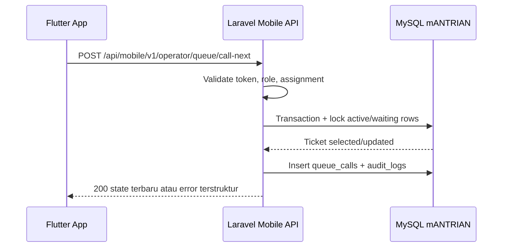

# MobileANTRIAN API dan Database Blueprint

## 1. Service Boundary

MobileANTRIAN wajib mengakses database MySQL mANTRIAN melalui Laravel API. Flutter client tidak menyimpan host, username, password, atau query SQL database. Semua aturan transaksi menggunakan backend agar tidak terjadi perbedaan perilaku antara operator web dan operator mobile.



## 2. Existing Database Mapping

| Table | Mobile Usage | Read | Write | Notes |
|---|---|---:|---:|---|
| `users` | Auth operator, profile | Yes | Limited | Update `last_login_at` saat login bila sesuai web behavior |
| `counter_assignments` | Menentukan loket operator | Yes | No | Admin web tetap pemilik data |
| `counters` | Nama/lokasi loket | Yes | No | Hanya counter aktif dapat dipakai |
| `counter_services` | Layanan yang dapat dipanggil loket | Yes | No | Dipakai filter waiting |
| `services` | Nama layanan dan status aktif | Yes | No | Hanya layanan aktif dipanggil |
| `tickets` | Queue state dan status | Yes | Yes via API action | Update status/timestamps hanya melalui action backend |
| `queue_calls` | Event call/recall/skip/done | Yes | Yes via API action | Append-only event log operasional |
| `audit_logs` | Audit keamanan dan aksi | Limited | Yes via logger | Append-only |
| `settings` | App metadata opsional | Yes | No | Bisa dipakai min app version/API config |
| `operating_hours` | Informasi layanan buka/tutup | Optional | No | Call action tetap mengikuti aturan backend |

## 3. Recommended API Standards

| Area | Standard |
|---|---|
| Base path | `/api/mobile/v1` |
| Protocol | HTTPS |
| Format | JSON UTF-8 |
| Auth | `Authorization: Bearer <token>` |
| Content Type | `application/json` |
| Idempotency | Header `Idempotency-Key` untuk POST aksi queue |
| Correlation | Header `X-Request-ID`; server mengembalikan nilai yang sama |
| Time format | ISO 8601 dari server |
| Timezone display | Dari server metadata, bukan asumsi device |

## 4. API Inventory

| API ID | Method | Path | Purpose | Auth | Request | Response | Errors |
|---|---|---|---|---|---|---|---|
| API-001 | GET | `/meta` | Info kompatibilitas API | No | - | app/API version, server time, timezone | `503` |
| API-002 | POST | `/auth/login` | Login operator | No | email, password, device metadata | token, user, assignment summary | `401`, `403`, `422` |
| API-003 | POST | `/auth/logout` | Logout dan revoke token | Bearer | - | success | `401` |
| API-004 | GET | `/me` | Profil operator dan assignment | Bearer | - | user, active assignment | `401`, `403` |
| API-005 | GET | `/operator/state` | Dashboard state loket | Bearer | optional `include_history` | counter, services, active ticket, waiting list, counts | `401`, `403`, `404` |
| API-006 | POST | `/operator/queue/call-next` | Panggil berikutnya | Bearer | counter_id | updated state, called ticket | `403`, `409`, `422` |
| API-007 | POST | `/operator/queue/{ticket}/recall` | Ulang panggil | Bearer | counter_id | updated state | `403`, `404`, `422` |
| API-008 | POST | `/operator/queue/{ticket}/skip` | Skip tiket aktif | Bearer | counter_id, reason | updated state | `403`, `404`, `422` |
| API-009 | POST | `/operator/queue/{ticket}/done` | Selesaikan tiket aktif | Bearer | counter_id, notes | updated state | `403`, `404`, `422` |
| API-010 | GET | `/operator/history` | Riwayat aksi operator hari ini | Bearer | date optional, limit | queue call events | `401`, `403`, `422` |

## 5. Canonical Response Envelope

### Success

```json
{
  "success": true,
  "request_id": "018f4f2e-7b6d-7000-8b6b-1a6db4d1f8a1",
  "server_time": "2026-05-06T23:59:10+08:00",
  "data": {}
}
```

### Error

```json
{
  "success": false,
  "request_id": "018f4f2e-7b6d-7000-8b6b-1a6db4d1f8a1",
  "error": {
    "code": "ACTIVE_TICKET_EXISTS",
    "message": "Loket masih memiliki tiket aktif.",
    "details": {}
  }
}
```

## 6. Key Payload Contracts

### API-002 Login Request

```json
{
  "email": "operator@example.test",
  "password": "password",
  "device": {
    "installation_id": "local-generated-uuid",
    "platform": "android",
    "app_version": "1.0.0",
    "device_name": "Samsung Tab A"
  }
}
```

### API-002 Login Response Data

```json
{
  "token": "plain-text-token-returned-once",
  "token_type": "Bearer",
  "user": {
    "id": 12,
    "name": "Operator Loket 1",
    "email": "operator@example.test",
    "role": "operator"
  },
  "assignment": {
    "id": 5,
    "counter": {
      "id": 1,
      "code": "LK-01",
      "name": "Loket 1",
      "location": "Ruang Pelayanan"
    },
    "services": [
      {
        "id": 1,
        "code": "ADM",
        "name": "Administrasi",
        "prefix": "A"
      }
    ]
  }
}
```

### API-005 Operator State Response Data

```json
{
  "assignment": {
    "id": 5,
    "counter": {
      "id": 1,
      "code": "LK-01",
      "name": "Loket 1",
      "location": "Ruang Pelayanan"
    },
    "services": [
      {
        "id": 1,
        "code": "ADM",
        "name": "Administrasi",
        "prefix": "A",
        "color": "#2563eb"
      }
    ]
  },
  "active_ticket": {
    "id": 20,
    "ticket_no": "A007",
    "service_name": "Administrasi",
    "status": "serving",
    "called_at": "2026-05-06T09:15:22+08:00",
    "started_at": "2026-05-06T09:15:22+08:00",
    "duration_seconds": 180
  },
  "waiting": [
    {
      "id": 21,
      "ticket_no": "A008",
      "service_name": "Administrasi",
      "created_at": "2026-05-06T09:16:10+08:00",
      "waiting_seconds": 132
    }
  ],
  "summary": {
    "waiting_total": 8,
    "served_today": 12,
    "skipped_today": 1
  }
}
```

## 7. Error Code Catalog

| Code | HTTP | Meaning | UI Handling |
|---|---:|---|---|
| `INVALID_CREDENTIALS` | 401 | Email/password salah | Tampilkan error login umum |
| `TOKEN_EXPIRED` | 401 | Token tidak valid/expired | Arahkan ke login |
| `ROLE_NOT_ALLOWED` | 403 | User bukan operator | Tampilkan akses ditolak |
| `USER_INACTIVE` | 403 | User nonaktif | Tampilkan hubungi admin |
| `ASSIGNMENT_REQUIRED` | 403 | Tidak ada assignment aktif | Tampilkan empty state assignment |
| `COUNTER_INACTIVE` | 403 | Loket nonaktif | Tampilkan hubungi admin |
| `QUEUE_EMPTY` | 409 | Tidak ada tiket waiting | Tampilkan "Belum ada antrian" |
| `ACTIVE_TICKET_EXISTS` | 409 | Loket masih punya tiket aktif | Tampilkan instruksi selesai/skip dahulu |
| `TICKET_NOT_ACTIVE_FOR_COUNTER` | 422 | Tiket tidak valid untuk loket | Refresh state dan tampilkan pesan |
| `VALIDATION_FAILED` | 422 | Payload tidak valid | Tampilkan validasi field |
| `API_VERSION_UNSUPPORTED` | 426 | App terlalu lama | Minta update aplikasi |
| `SERVER_ERROR` | 500 | Error backend | Tampilkan retry dan request ID |

## 8. Transaction and Concurrency Rules

| ID | Rule | Implementation Expectation |
|---|---|---|
| TX-001 | `call-next` wajib berada dalam DB transaction | Gunakan pattern existing `CallNextTicketAction` |
| TX-002 | Cek active ticket loket memakai lock | Hindari dua call bersamaan dari web dan mobile |
| TX-003 | Pilih waiting FIFO memakai lock | Ticket yang sama tidak bisa dipanggil dua loket |
| TX-004 | Insert `queue_calls` setelah update ticket | Event history harus mengikuti state final |
| TX-005 | Audit log setelah event utama | `metadata.source=mobile`, `counter_id`, `request_id`, `device.installation_id` |
| TX-006 | Idempotency key mencegah double tap | Simpan hash key+actor+route sementara di cache 60 detik atau tabel khusus |

## 9. Backend Implementation Notes

| Area | Recommendation |
|---|---|
| Route file | Tambahkan `routes/api.php` bila belum ada, namespace `/api/mobile/v1` |
| Controller | `App\Http\Controllers\Api\Mobile\AuthController`, `OperatorQueueController`, `MetaController` |
| Resources | Gunakan Laravel API Resource untuk `OperatorStateResource`, `TicketResource`, `CounterResource` |
| Auth package | Laravel Sanctum direkomendasikan |
| Shared logic | Reuse `CallNextTicketAction`, `RecallTicketAction`, `SkipTicketAction`, `CompleteTicketAction` |
| State service | Tambahkan `OperatorStateService` agar web/mobile dapat berbagi query bila dibutuhkan |
| Audit | Extend `AuditLogger` agar menerima source metadata dan request ID |

## 10. Requirement-to-API Traceability

| Requirement | API | Tables |
|---|---|---|
| FR-001 Login operator | API-002 | `users`, token table, `audit_logs` |
| FR-004 Assignment aktif | API-004, API-005 | `counter_assignments`, `counters`, `services` |
| FR-006 Active ticket | API-005 | `tickets`, `queue_calls` |
| FR-010 Call next | API-006 | `tickets`, `queue_calls`, `audit_logs` |
| FR-013 Recall | API-007 | `queue_calls`, `audit_logs` |
| FR-014 Skip | API-008 | `tickets`, `queue_calls`, `audit_logs` |
| FR-016 Done | API-009 | `tickets`, `queue_calls`, `audit_logs` |
| FR-017 History | API-010 | `queue_calls` |
